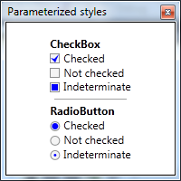

Today I'd like to share a trick that I used quite often in the past few months. Let's assume that in order to improve the look of your application, you created custom styles for the standard controls:    OK, I'm not a designer... but it will serve the purpose well enough to illustrate my point ;). These styles are very simple, they're just the default styles of `CheckBox` and `RadioButton` in which I only changed the templates to replace the `BulletChrome`s with these awesome blue tick marks. Here's the code:  
```xml
        <Style x:Key="{x:Type CheckBox}" TargetType="{x:Type CheckBox}">
            <Setter Property="Foreground" Value="{DynamicResource {x:Static SystemColors.ControlTextBrushKey}}"/>
            <Setter Property="Background" Value="{StaticResource CheckBoxFillNormal}"/>
            <Setter Property="BorderBrush" Value="{StaticResource CheckBoxStroke}"/>
            <Setter Property="BorderThickness" Value="1"/>
            <Setter Property="FocusVisualStyle" Value="{StaticResource EmptyCheckBoxFocusVisual}"/>
            <Setter Property="Template">
                <Setter.Value>
                    <ControlTemplate TargetType="{x:Type CheckBox}">
                        <BulletDecorator Background="Transparent"
                                         SnapsToDevicePixels="true">
                            <BulletDecorator.Bullet>
                                <Border BorderBrush="{TemplateBinding BorderBrush}"
                                        Background="{TemplateBinding Background}"
                                        BorderThickness="1"
                                        Width="11" Height="11" Margin="0,1,0,0">
                                    <Grid>
                                        <Path Name="TickMark"
                                              Fill="Blue"
                                              Data="M0,4 5,9 9,0 4,5"
                                              Visibility="Hidden" />
                                        <Rectangle Name="IndeterminateMark"
                                                   Fill="Blue"
                                                   Width="7" Height="7"
                                                   HorizontalAlignment="Center"
                                                   VerticalAlignment="Center"
                                                   Visibility="Hidden" />
                                    </Grid>
                                </Border>
                            </BulletDecorator.Bullet>
                            <ContentPresenter HorizontalAlignment="{TemplateBinding HorizontalContentAlignment}"
                                              Margin="{TemplateBinding Padding}"
                                              RecognizesAccessKey="True"
                                              SnapsToDevicePixels="{TemplateBinding SnapsToDevicePixels}"
                                              VerticalAlignment="{TemplateBinding VerticalContentAlignment}"/>
                        </BulletDecorator>
                        <ControlTemplate.Triggers>
                            <Trigger Property="HasContent" Value="true">
                                <Setter Property="FocusVisualStyle" Value="{StaticResource CheckRadioFocusVisual}"/>
                                <Setter Property="Padding" Value="4,0,0,0"/>
                            </Trigger>
                            <Trigger Property="IsEnabled" Value="false">
                                <Setter Property="Foreground" Value="{DynamicResource {x:Static SystemColors.GrayTextBrushKey}}"/>
                            </Trigger>
                            <Trigger Property="IsChecked" Value="True">
                                <Setter TargetName="TickMark" Property="Visibility" Value="Visible" />
                            </Trigger>
                            <Trigger Property="IsChecked" Value="{x:Null}">
                                <Setter TargetName="IndeterminateMark" Property="Visibility" Value="Visible" />
                            </Trigger>
                        </ControlTemplate.Triggers>
                    </ControlTemplate>
                </Setter.Value>
            </Setter>
        </Style>
        <Style x:Key="{x:Type RadioButton}" TargetType="{x:Type RadioButton}">
            <Setter Property="Foreground" Value="{DynamicResource {x:Static SystemColors.ControlTextBrushKey}}"/>
            <Setter Property="Background" Value="#F4F4F4"/>
            <Setter Property="BorderBrush" Value="{StaticResource CheckBoxStroke}"/>
            <Setter Property="BorderThickness" Value="1"/>
            <Setter Property="Template">
                <Setter.Value>
                    <ControlTemplate TargetType="{x:Type RadioButton}">
                        <BulletDecorator Background="Transparent">
                            <BulletDecorator.Bullet>
                                <Grid VerticalAlignment="Center" Margin="0,1,0,0">
                                    <Ellipse Width="11" Height="11"
                                             Stroke="{TemplateBinding BorderBrush}"
                                             StrokeThickness="1"
                                             Fill="{TemplateBinding Background}" />
                                    <Ellipse Name="TickMark"
                                             Width="7" Height="7"
                                             Fill="Blue"
                                             Visibility="Hidden" />
                                    <Ellipse Name="IndeterminateMark"
                                             Width="3" Height="3"
                                             Fill="Blue"
                                             Visibility="Hidden" />
                                </Grid>
                            </BulletDecorator.Bullet>
                            <ContentPresenter HorizontalAlignment="{TemplateBinding HorizontalContentAlignment}"
                                              Margin="{TemplateBinding Padding}"
                                              RecognizesAccessKey="True"
                                              VerticalAlignment="{TemplateBinding VerticalContentAlignment}"/>
                        </BulletDecorator>
                        <ControlTemplate.Triggers>
                            <Trigger Property="HasContent" Value="true">
                                <Setter Property="FocusVisualStyle" Value="{StaticResource CheckRadioFocusVisual}"/>
                                <Setter Property="Padding" Value="4,0,0,0"/>
                            </Trigger>
                            <Trigger Property="IsEnabled" Value="false">
                                <Setter Property="Foreground" Value="{DynamicResource {x:Static SystemColors.GrayTextBrushKey}}"/>
                            </Trigger>
                            <Trigger Property="IsChecked" Value="True">
                                <Setter TargetName="TickMark" Property="Visibility" Value="Visible" />
                            </Trigger>
                            <Trigger Property="IsChecked" Value="{x:Null}">
                                <Setter TargetName="IndeterminateMark" Property="Visibility" Value="Visible" />
                            </Trigger>
                        </ControlTemplate.Triggers>
                    </ControlTemplate>
                </Setter.Value>
            </Setter>
        </Style>
```
  OK, so you now have beautiful controls that are going to make the app a big success, management is happy, everything is for the best... until you realize that in another view of the application, the controls need to have the same style, but with green tick marks!  The first solution that comes to mind is to duplicate the style, and replace blue with green in the copy. But since you're a good developer who cares about best practices, you know that duplicate code is evil: if you ever need to make changes to the style of the blue `CheckBox`, you will also have to modify the green one... and perhaps the red one, and the black one, etc. Clearly it would soon become unmanageable. So we need to refactor, but how? Ideally we would pass parameters to the style, but a style is not a method that you can call with various parameters...  What we need is an extra property that controls the color of the tick marks, so we can bind to this property in the template. A possible approach is to create custom controls that inherit `CheckBox` and `RadioButton`, with an extra `TickBrush` property... but personnally I don't really like this approach, I always prefer to use the built-in controls when they can fit the bill.  Anyway, there is an easier solution: we just need to create a `ThemeProperties` class with an attached property of type `Brush`:  
```csharp
    public static class ThemeProperties
    {
        public static Brush GetTickBrush(DependencyObject obj)
        {
            return (Brush)obj.GetValue(TickBrushProperty);
        }

        public static void SetTickBrush(DependencyObject obj, Brush value)
        {
            obj.SetValue(TickBrushProperty, value);
        }

        public static readonly DependencyProperty TickBrushProperty =
            DependencyProperty.RegisterAttached(
                "TickBrush",
                typeof(Brush),
                typeof(ThemeProperties),
                new FrameworkPropertyMetadata(Brushes.Black));
    }
```
  We change the templates a bit to replace the hard-coded color with a binding to this property:  
```xml
                                ...

                                <!-- CheckBox -->
                                        <Path Name="TickMark"
                                              Fill="{TemplateBinding my:ThemeProperties.TickBrush}"
                                              Data="M0,4 5,9 9,0 4,5"
                                              Visibility="Hidden" />
                                        <Rectangle Name="IndeterminateMark"
                                                   Fill="{TemplateBinding my:ThemeProperties.TickBrush}"
                                                   Width="7" Height="7"
                                                   HorizontalAlignment="Center"
                                                   VerticalAlignment="Center"
                                                   Visibility="Hidden" />

                                ...

                                <!-- RadioButton -->
                                    <Ellipse Name="TickMark"
                                             Width="7" Height="7"
                                             Fill="{TemplateBinding my:ThemeProperties.TickBrush}"
                                             Visibility="Hidden" />
                                    <Ellipse Name="IndeterminateMark"
                                             Width="3" Height="3"
                                             Fill="{TemplateBinding my:ThemeProperties.TickBrush}"
                                             Visibility="Hidden" />
```
  And when we use the controls, we set the property to the desired tick color:  
```xml
<CheckBox Content="Checked" IsChecked="True" my:ThemeProperties.TickBrush="Blue" />
```
  So we can now have controls that share the same style, but have different colors for the tick mark:    Isn't it great? However there is a small problem left: since controls on the same view all use the same tick color, it's not very convenient to repeat the color on each one. It would be nice to be able to specify the color just once, on the root of the view... Well, as it happens, dependency properties have a nice feature that allows to do exactly that: value inheritance. We just need to specify the `Inherits` flag in the declaration of the `TickBrush` property:  
```csharp
        public static readonly DependencyProperty TickBrushProperty =
            DependencyProperty.RegisterAttached(
                "TickBrush",
                typeof(Brush),
                typeof(ThemeProperties),
                new FrameworkPropertyMetadata(Brushes.Black, FrameworkPropertyMetadataOptions.Inherits));
```
  With this flag, the property becomes "ambient": we only need to specify its value on a parent control, and all descendant controls will automatically inherit the value. So if you need a view where all the checkboxes and radiobuttons are red, just set the `TickBrush` property to `Red` on the root element of the view.  Obviously this concept can be extended to other cases: actually, every time an element of the template must change based on arbitrary criteria, this technique can be used. It can be a good alternative to duplicating a template when you only need to change a small part of it.  

