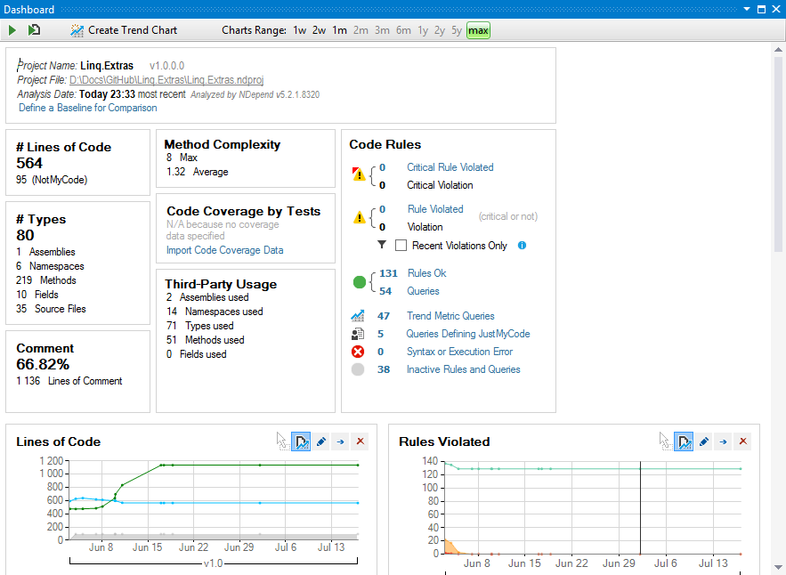
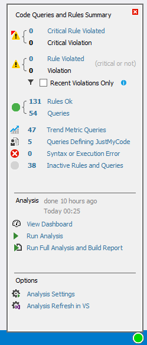
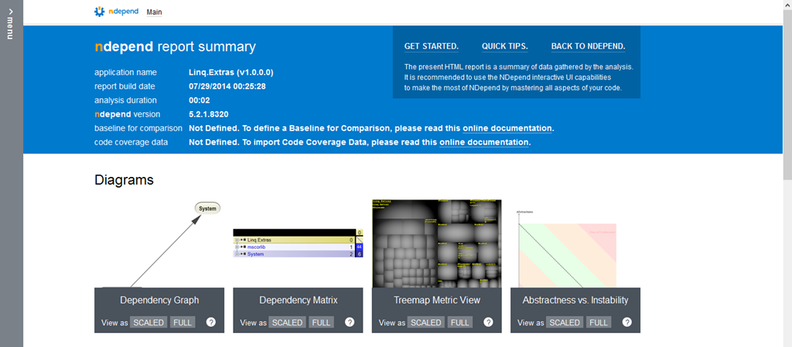
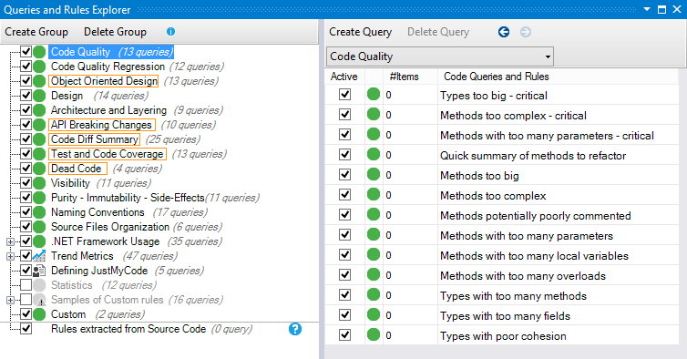
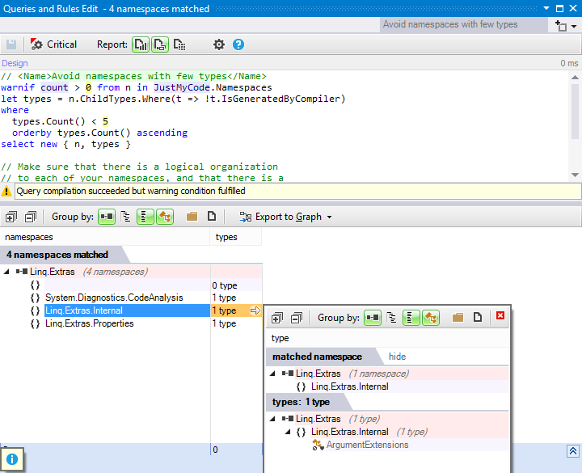
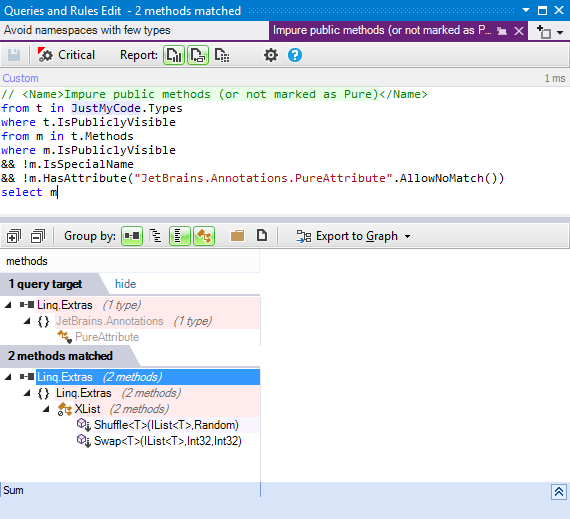
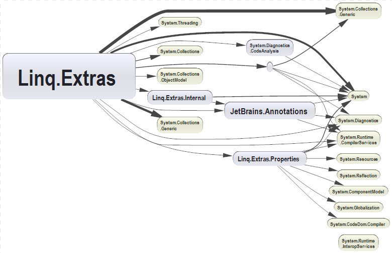
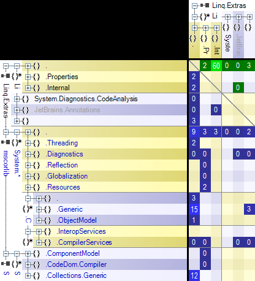

I’ve been hearing quite a lot about [NDepend](http://www.ndepend.com/) over the last few years, but I had never tried it until recently, when its creator Patrick Smacchia was kind enough to offer me a license.

NDepend is a static analysis tool for .NET that checks your code base against a large set of rules that fall in various categories, such as code quality, object-oriented design, architecture, naming conventions, etc. All of these rules are completely customizable. It can be used as a standalone tool, or as a Visual Studio extension; there is also a command-line tool to integrate in the build process.

I should note that it’s the first time I write a software review, so this exercise is completely new to me. Although I was offered a free license, I’m not affiliated with NDepend in any way, and I’ll do my best to be as fair and unbiased as possible.

## Setup experience

NDepend doesn’t have an installer: it’s just a zip file that you extract into a folder. From there you can run the standalone tool (*VisualNDepend.exe*), and install the VS plugin (*NDepend.Install.VisualStudioAddin.exe*).

There is no UI to enter the license key either; you just drop the *NDependProLicense.xml* file into the NDepend folder.

Admittedly, this tool is intended for professional developers who shouldn’t have any problem with those steps, so it’s not that big a deal, but a more streamlined setup experience would have been nicer.

### UI

Perhaps it’s just me, but I found the UI a little confusing; there are just too many windows and tooltips that pop open all the time (I used the tool mostly as a VS extension). NDepend needs *a lot* of screen space to work comfortably, and at home I only have one screen with a lower-than-average resolution, which made it a bit awkward to use for me.

To be fair, the Dashboard gives a pretty good overview of the project. In the VS extension, there is also an icon in the status bar that lets you see at a glance the code queries and rule violations (click the images to enlarge).

You can also view a full report that is rendered as webpage and contains a lot of relevant information about your project.

This report can be customized to your specific needs in the NDepend project properties.

### Code queries and rules

This is, in my opinion, the best thing about NDepend : the code inspection engine is extremely powerful and customizable. NDepend comes with a lot of default rules :

(in this screenshot I have already fixed all warnings, so all rules show a count of 0)

These rules are defined using a domain specific language called CQLinq, which allows you to write complex queries about your code using the familiar Linq syntax. For instance, here’s a simple one that checks for namespaces with few types:

The default rules often come with comments that give more information about the rule and explain why it’s relevant. As you can see, the code is mostly standard Linq, and the editor has syntax highlighting and Intellisense. NDepend’s code model includes about everything you could expect (classes, methods, etc), but also a lot of extra information like cyclomatic complexity, number of IL instructions, dependencies between classes or namespaces, etc. The result presentation is quite smart; depending on the output of the query, it shows namespaces, types or members organized by assembly. Result columns that contain lists can be clicked to view the elements of the list, and a click on a code item jumps to the location in code.

Each rule can be enabled or disabled, or set as critical or not. You can modify the default rules, or create your own. Note that rules don’t have to be warnings: you can create a code query that just reports information about your code:

So as you can see, CQLinq is a powerful way to check just about any design rule you care to enforce about your code.

Of course, the feature is not perfect… Here are a few downsides:

- There are *a lot* of default rules. Arguably, that could also be counted as a quality, but the first time you run NDepend on your project, the sheer number of reported rule violations is quite overwhelming, and usually you don’t really care about most of them. So you have to spend quite a long time reviewing the results to decide which rules you really care about, which ones need to be adjusted to your need, etc. When I did it on a rather small project, it took me 2 hours to fix all warnings; not because I had a lot of things to fix in my code, but because I had a lot of things to fix in the rules! I’m not saying my code was perfect, obviously, and NDepend did help me find and fix a few issues, but many of the rules weren’t really relevant in my specific project. So, if you use NDepend, expect to spend a lot of time adjusting the rules to your needs; once you do that, the tool will really shine, and the analysis results will be a lot more useful to you.
- There is no easy way to “suppress” a specific occurrence of a rule violation. For instance, in ReSharper you can suppress a warning with a special comment (and the quick fix menu lets you add that comment automatically); in FxCop, you can apply the `[SuppressMessage]` attribute to a type or member. There is nothing like that in NDepend; if you want to exclude a code item from a rule, you have to modify the code of the CQLinq query itself. Given the flexibility of the query language, it’s understandable that there is no generic way to suppress warnings, but still, it’s annoying; it also means that you can’t just reuse the exact same queries in other projects. There is however a nice feature that partly counterbalances the lack of a generic suppression mechanism: the JustMyCode context. It defines a “view” of the code that only includes your own code, not the code generated by designers or by the compiler. So you can query against the JustMyCode context to ignore rule violations in code that you didn’t write, and you can customize what is considered “not your code” using the same CQLinq syntax.
- Queries that take IL statistics (number of IL instructions, IL cyclomatic complexity, etc) into account are often biased by complex code constructs such as iterator blocks, anonymous methods or async methods, which results in false positives. Some methods are complex at the IL level, and reported as such, even though the original C# code is rather straightforward.

### Dependency management

I guess that’s the feature that gave the tool its name, even though now it does much more than that… NDepend can give you very detailed information about dependencies between assemblies and namespaces (your own, as well as framework or third party assemblies). The dependencies can be viewed as a directed graph:

Or as a matrix:

Both views are interactive; the matrix view can even be “drilled down” to view dependencies at a lower level.

I didn’t really take advantage of the dependency-related features, because I only tested NDepend on simple projects, but they can certainly be very useful in large solutions to eliminate unwanted coupling between different parts of the code.

### Code evolution analysis

NDepend also lets you to compare analysis results between builds. Basically, you set a baseline for the comparison, and it gives you trends to measure the progress of various code metrics over time. I didn’t use this feature myself so I can’t really talk in detail about it, but its usefulness is quite obvious for large projects as it lets you see which aspects are improving or worsening, allowing you to refocus the team’s efforts as necessary.

### Conclusion

I have to say that I’m very impressed by NDepend’s analysis engine; it’s incredibly powerful, and the fact that the rules are completely customizable opens a world of possibilities. I love the fact that I can just write a simple Linq query to find all classes or methods that match certain criteria. Regarding the other features, like dependency management, I’m sure they can be very useful, but most of the projects I work on are rather small, so dependencies are usually not a major issue for me.

The way I see it, NDepend is a great tool to keep close tabs on the architecture of large projects, but is probably overkill for small projects. It’s also very useful if you need to enforce strict design guidelines across a large code base; obviously, it won’t completely replace code review, but it can certainly be a big help in the review process.

In any case, NDepend has a lot of obvious qualities, but it’s probably not the right tool for everyone. The only way to decide if you need it or not is to [try it for yourself](http://www.ndepend.com/NDependDownload.aspx), and see how it works out for you!

