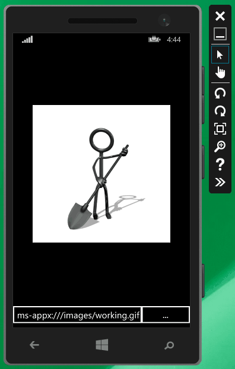

A few years ago, I wrote [an article](/2011/03/27/wpf-display-an-animated-gif-image/) that showed how to display an animated GIF in WPF. The article included the full code, and was quite successful, since WPF had no built-in support for animated GIFs. Based on the issues reported in the comments, I made many edits to the code in the article. At some point I realized it was very impractical, so I published the code on CodePlex (it has now moved to GitHub) under the name [WpfAnimatedGif](https://github.com/thomaslevesque/WpfAnimatedGif), and started maintaining it there. It was my first serious open-source project, and it was quite popular.

As bug reports started coming in, a serious issue was quickly identified: the library was using a *huge* amount of memory. There were a few leaks that I fixed, but ultimately the problem was inherent to the way the library worked: it prepared all frames in advance, keeped them in memory, and displayed them in turn using an WPF animation. Having all the frames pre-rendered in memory was reasonable for small images with few frames, but totally impractical for large GIF animations with many frames.

Changing the core of the library to use another approach might have been possible, but there were other issues I wanted to address. For instance, it relied heavily on WPF imaging features, which made it impossible to port it to Windows Phone or Windows Store apps. Also, some parts of the code were quite complex and inefficient, partly because of my initial choice to specify the image as an `ImageSource`, and changing that would have broken compatibility with previous versions.

## WpfAnimatedGif is dead, long live XamlAnimatedGif!

So I decided to restart from scratch to address these issues, and created a new project: [XamlAnimatedGif](https://github.com/thomaslevesque/XamlAnimatedGif) (as you can see, I’m not very imaginative when it comes to names).

On the surface, it seems very similar to WpfAnimatedGif, but at its core it uses a completely different approach. Instead of preparing the frames in advance, they are rendered on the fly using a [WriteableBitmap](http://msdn.microsoft.com/fr-fr/library/system.windows.media.imaging.writeablebitmap.aspx). This approach uses more CPU, but much less RAM. Also, in order to be portable, I couldn’t rely on WPF’s built-in image decoding, so I had to implement a full GIF decoder, including LZW decompression of the pixel data. Matthew Flickinger’s article [“What’s In A GIF”](http://www.matthewflickinger.com/lab/whatsinagif/index.html) was a big help.

The basic usage is roughly the same: just set an attached property on an `Image` control to specify the GIF animation source.

```
<Image gif:AnimationBehavior.SourceUri="/images/working.gif" />
```

Here’s the result in the Windows Phone emulator (yes, it’s a animated GIF representing an animated GIF… I guess it could be called a meta-GIF ):



Unlike WpfAnimatedGif, the source is specified as an URI or as a stream, rather than an `ImageSource`. It makes the internal implementation much simpler and more robust.

XamlAnimatedGif currently works on WPF 4.5, Windows 8.1 store apps, and Windows Phone 8.1. It could be extended to support other platforms (WPF 4.0, Windows 8.0, Windows Phone 8.0, Windows Phone Silverlight 8.1, perhaps Silverlight 5), but so far I just focused on making it work on the most recent XAML platforms. I’m not sure if it’s possible to support iOS and Android as well, as I haven’t looked into Xamarin yet. If you want to give it a try, I’ll be glad to accept contributions.

The library is still labeled alpha because it’s new, but it seems reasonably stable so far. You can install it [from NuGet](http://www.nuget.org/packages/XamlAnimatedGif/):

```
PM> Install-Package XamlAnimatedGif -Pre 
```

