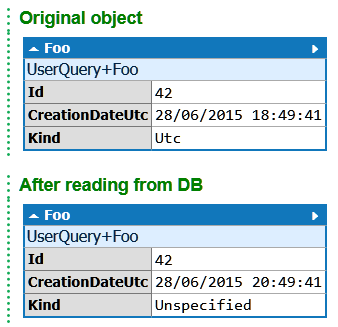
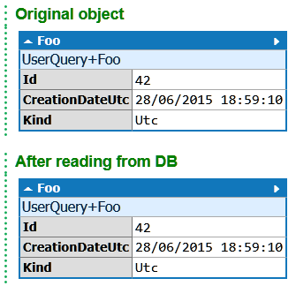

[SQLite](http://sqlite.org/) is a nice in-process database engine: it’s very lightweight, doesn’t require any server or configuration, and runs on all platforms. There is even an [official ADO.NET provider](http://system.data.sqlite.org/) that’s very well made. However, if you store dates as UTC with this provider, you will probably encounter a serious issue: even though the date is properly stored as UTC (it’s stored in a form similar to ISO8601, with a ‘Z’ to indicate the UTC timezone), when you read it back from the database, you will get a `DateTime` converted to local time, with `Kind` = `Unspecified`. Here’s an example that exhibits the problem (using [Dapper](https://github.com/StackExchange/dapper-dot-net) in [LINQPad](http://www.linqpad.net/)):

```csharp
void Main()
{
    string connectionString = @"Data Source=D:\tmp\testSQLiteDate.db";
    using (var connection = new SQLiteConnection(connectionString))
    {
        connection.Open();
        connection.Execute("create table Foo(Id integer not null primary key, CreationDateUtc datetime not null)");
        
        var foo = new Foo{Id = 42, CreationDateUtc = DateTime.UtcNow};
        foo.Dump("Original object");
        connection.Execute("insert into Foo(Id, CreationDateUtc) values (@Id, @CreationDateUtc)", foo);
        var foo2 = connection.Query<Foo>("select * from Foo where Id = @Id", new{ Id = 42 }).SingleOrDefault();
        foo2.Dump("After reading from DB");
    }
}

class Foo
{
    public int Id { get; set; }
    public DateTime CreationDateUtc { get; set; }
    public DateTimeKind Kind { get { return CreationDateUtc.Kind; } }
}
```

Here’s the output:



As you can see, after reading it from the database, the date is no longer in UTC, and doesn’t even contain an indication that it’s a local date. This can cause all kinds of bugs if your code is comparing dates that are supposed to be UTC.

I initially tried to fix that in my code by manually converting the date, before I realized that the solution was much simpler (although [not very well documented](http://www.nudoq.org/#!/Packages/System.Data.SQLite/System.Data.SQLite/SQLiteConnectionStringBuilder/P/DateTimeKind)): there is a connection string setting to control how dates are handled. You just need to specify `DateTimeKind=Utc` in your connection string:

```csharp
string connectionString = @"Data Source=D:\tmp\testSQLiteDate.db;DateTimeKind=Utc";
```

If you’re using `SqliteConnectionStringBuilder` to build the connection string, just set the `DateTimeKind` property to `DateTimeKind.Utc`.

As you can see, the date kind is now preserved:




**Important caveat:** this setting will apply to **all** dates read from this connection. If you have dates that were not stored as UTC, the provider will assume that they are UTC dates anyway, which will produce incorrect results. So, only do this if you store all dates as UTC.

